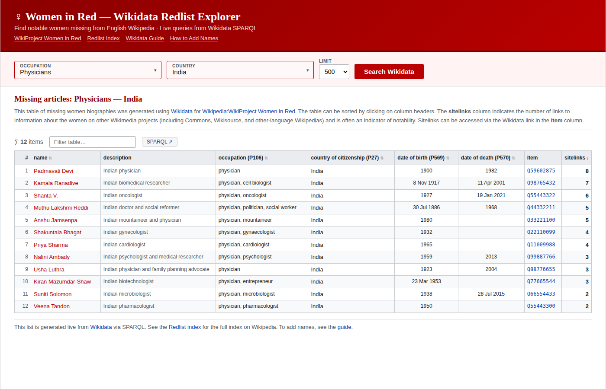

# ♀ Women in Red — Wikidata Redlist Explorer

A standalone browser tool that queries Wikidata in real time to find notable women missing from English Wikipedia. Built for [WikiProject Women in Red](https://en.wikipedia.org/wiki/Wikipedia:WikiProject_Women_in_Red).

  

  <strong>👉 <a href="https://wir-redlist-explorer.toolforge.org/">wir-redlist-explorer.toolforge.org</a> 👈</strong> 
  <small>(also available via <a href="https://nethahussain.github.io/wir-redlist-explorer/">nethahussain.github.io/wir-redlist-explorer</a>, which redirects to Toolforge)</small>

---

*Screenshot showing sample results for Physicians — India. Names displayed as red links (no English Wikipedia article exists). The tool queries Wikidata live, so actual results will vary.*

## What it does

The [Women in Red Redlist Index](https://en.wikipedia.org/wiki/Wikipedia:WikiProject_Women_in_Red/Redlist_index) on Wikipedia maintains hundreds of Wikidata-generated lists of women who have Wikidata items but no English Wikipedia article. These lists are generated by [ListeriaBot](https://www.wikidata.org/wiki/Wikidata:ListeriaBot) from SPARQL queries and organized by occupation, nationality, and other criteria.

This tool provides a standalone, searchable interface to the same data:

- **Filter by occupation** — ~90 occupations across 10 categories (Science, Arts, Politics, Sports, etc.)
- **Filter by country** — ~130 countries, flat alphabetical list
- **Filter by both simultaneously** — e.g. "Physicians in India" or "Painters from Nigeria"
- **Live SPARQL queries** — Results are always current, sourced directly from the Wikidata Query Service
- **Wikipedia-style table** — Columns match the standard Redlist format:
  - `name` — Red-linked to Wikipedia article creation page
  - `description` — Wikidata description
  - `occupation (P106)` — All occupations from Wikidata
  - `country of citizenship (P27)` — Country from Wikidata
  - `date of birth (P569)` / `date of death (P570)`
  - `item` — Linked Wikidata QID
  - `sitelinks` — Number of Wikimedia sitelinks (notability indicator)
- **Sortable columns** — Click any column header to sort
- **In-table filter** — Search/filter within results
- **Configurable limit** — 100, 200, 500, or 1000 results

## How it works

The tool constructs SPARQL queries against the [Wikidata Query Service](https://query.wikidata.org/) that:

1. Find items that are **human** (`P31 = Q5`) and **female** (`P21 = Q6581072`)
2. Match the selected **occupation** (`P106`) and/or **country** (via `P27`, `P17`, `P495`, `P1532`, or `P19→P17`)
3. **Exclude** items that already have an English Wikipedia article using the standard `FILTER NOT EXISTS` clause on the `schema:isPartOf <https://en.wikipedia.org/>` graph — the same filter used by all Women in Red Wikidata redlists
4. Return results ordered by **sitelink count** (descending) as a rough notability proxy

The country matching uses the same multi-property approach documented in the [Wikidata redlist guide](https://en.wikipedia.org/wiki/Wikipedia:WikiProject_Women_in_Red/Wikidata_redlist_guide) to catch women who may not have `country of citizenship` set but do have `place of birth` in that country.

## Technical details

- **Single HTML file** — No build step, no dependencies, no framework
- **Client-side only** — All queries run in the browser via `fetch()` to `query.wikidata.org`
- **Deployable anywhere** — GitHub Pages, any static host, or open locally as a file
- **SPARQL timeout** — The Wikidata endpoint has a 60-second timeout; very broad queries (e.g. all Athletes worldwide) may time out. Use the limit selector or add both filters to narrow results.

## Data sources

| Property | Wikidata ID | Usage |
|----------|-------------|-------|
| instance of | P31 | Filter to humans (Q5) |
| sex or gender | P21 | Filter to female (Q6581072) |
| occupation | P106 | Occupation filter |
| country of citizenship | P27 | Primary country filter |
| country | P17 | Fallback country filter |
| country of origin | P495 | Fallback country filter |
| country for sport | P1532 | Fallback country filter |
| place of birth → country | P19 → P17 | Fallback country filter |
| date of birth | P569 | Display column |
| date of death | P570 | Display column |

## Related projects

- [WikiProject Women in Red](https://en.wikipedia.org/wiki/Wikipedia:WikiProject_Women_in_Red)
- [Redlist Index](https://en.wikipedia.org/wiki/Wikipedia:WikiProject_Women_in_Red/Redlist_index)
- [Wikidata Redlist Guide](https://en.wikipedia.org/wiki/Wikipedia:WikiProject_Women_in_Red/Wikidata_redlist_guide)
- [How to Add Names to Women in Red Lists](https://en.wikipedia.org/wiki/Wikipedia:WikiProject_Women_in_Red/How_to_add_names_to_Women_in_Red_lists)
- [Humaniki — Wikipedia Gender Statistics](https://humaniki.wmcloud.org/)

## MediaWiki version (for English Wikipedia)

A version that runs natively on English Wikipedia as a user script is available in the [`mediawiki/`](mediawiki/) directory. It uses MediaWiki's built-in OOUI widgets and `wikitable sortable` classes. See [`mediawiki/README.md`](mediawiki/README.md) for installation instructions.

## Other languages

A Ukrainian version is available: [`tool-uk.html`](tool-uk.html) ([live demo](https://nethahussain.github.io/wir-redlist-explorer/tool-uk.html)). To translate the tool into another language, see the [Translation Guide](TRANSLATION_GUIDE.md).

## License

CC0

## Author

[Netha Hussain](https://github.com/nethahussain)
